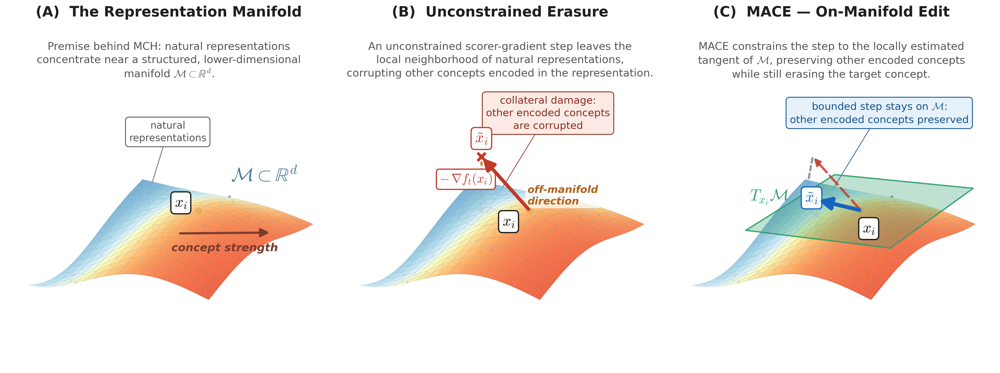
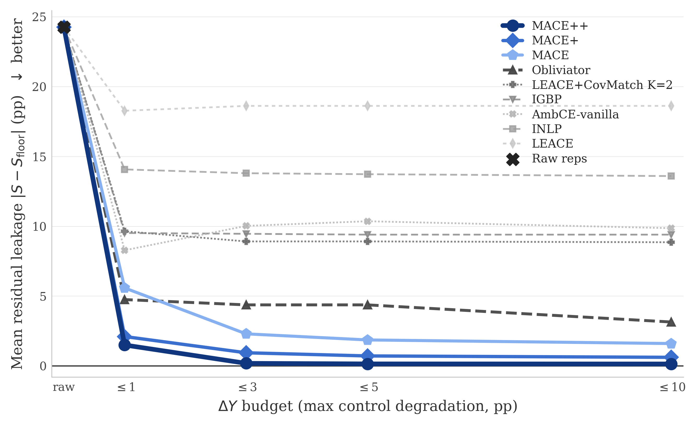
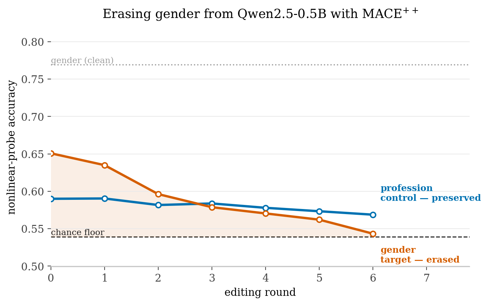

# <div align="center">MACE: Manifold Aware Concept Erasure</div>
<div align="center">Matan Avitan, Yoav Goldberg, Yanai Elazar
<br><br>

A clean reference implementation of **MACE**, **MACE⁺**, and **MACE⁺⁺**.
</div>

<p align="center">

</p>
<p align="center"><em>(A)</em> Natural representations concentrate near a low-dimensional manifold.
<em>(B)</em> The raw scorer gradient erases the concept but leaves the manifold,
damaging unlabeled control concepts. <em>(C)</em> <b>MACE</b> projects the gradient
onto the local tangent space and takes a bounded on-manifold step, preserving control.</p>

# TL;DR
Concept erasure removes a target attribute (e.g. *gender*) from a representation
while preserving everything else. It is hard because neural representations
exhibit **superposition**: concept directions interfere, the concepts that must
be preserved are usually unknown, and information hidden from one probe can be
recovered by a new nonlinear probe.

We propose the **Manifold Constraint Hypothesis (MCH)**: natural
representations concentrate in a structured, lower-dimensional region, so
interventions constrained to directions supported by *nearby natural
representations* should preserve the other information encoded in the
representation better than comparably sized unconstrained edits. We
instantiate MCH with **MACE**: it confines each edit to the local manifold
geometry rather than moving freely across all of Euclidean space — estimating
local directions from neighboring **natural (unedited) representations**
`X⁽⁰⁾` and using a nonlinear probe to reduce recoverable target information.

# What we found
Locally constrained updates improve the leakage–surgicality tradeoff relative to
matched full-space updates, and strengthen prior erasure methods without
exceeding the allowed control degradation. **MACE⁺⁺** achieves
state-of-the-art nonlinear erasure results across 119 settings spanning text and
vision (13 language models, 3 NLP concepts, 40 CelebA-CLIP attributes).

<p align="center">

</p>
<p align="center"><em>Across the NLP suite, the MACE family attains the lowest residual concept
leakage at every control-degradation budget ΔY (lower is better); MACE⁺⁺ is SOTA.</em></p>

# The method, in one paragraph
Given representations and target-concept labels, MACE runs an iterative
editing loop (Algorithm 1 in the paper). Each round it

1. fits / reuses a nonlinear **concept probe** on the current representations;
2. estimates a **local tangent basis** `Bᵢ` at each (edited) representation by
   local PCA on its `k` nearest neighbors among the **natural, unedited
   representations** `X⁽⁰⁾` — the edits move the query point, but the manifold
   is always estimated from natural geometry;
3. builds a **spectrally-weighted tangent erasure direction**
   `dᵢ = Bᵢ diag(σᵢ^α) Bᵢᵀ uᵢ` from the probe's unit input gradient `uᵢ`; and
4. applies the largest per-row step allowed by a **local-radius trust region**
   `‖x̃ᵢ − xᵢ‖ ≤ ε·rᵢ`, where `rᵢ` is the mean distance to the `k` neighbors.

The three variants differ only in optional closed-form preprocessing applied
*before* the loop:

| Variant      | Preprocessing                                       | Default |
|--------------|-----------------------------------------------------|:-------:|
| `mace`       | none                                                |         |
| `mace+`      | LEACE (mean / first-moment linear signal)           |         |
| `mace++`     | LEACE + CovMatch (leading covariance asymmetry ΔΣ)  |   ✅    |

# Quickstart notebook
[`notebooks/biasbios_quickstart.ipynb`](notebooks/biasbios_quickstart.ipynb) is
the place to start. It extracts (or loads cached) Bias-in-Bios representations
from `Qwen/Qwen2.5-0.5B`, runs all three MACE variants to erase **gender**, and
shows that the gender probe collapses toward chance while the **profession**
control probe is preserved.

```python
from mace import MACE
from mace.data import load_or_extract_biasbios

reps = load_or_extract_biasbios()                  # cached .npz, or extract from the LM

eraser = MACE(variant="mace++", epsilon=0.1)       # mace++ is the default
result = eraser.fit_erase(
    reps.X_train, reps.gender_train,
    reps.X_val,   reps.gender_val,
    reps.X_test,  reps.gender_test,
    control_train=reps.profession_train,           # optional: logged, never erased
    control_val=reps.profession_val,
    control_test=reps.profession_test,
)
print(result.history[-1])   # {'step': ..., 'concept_acc': ~floor, 'control_acc': ~preserved}
```

<p align="center">

</p>
<p align="center"><em>Erasing gender from Qwen2.5-0.5B BiasBios representations with MACE⁺⁺:
the gender probe collapses toward chance while the profession control probe is preserved.</em></p>

# Installation
```bash
git clone <this-repo> && cd mace
pip install -e .                       # core method + evaluation
pip install -e ".[data,notebook]"      # + BiasBios extraction + the notebook
```
Requires Python ≥ 3.10 and PyTorch. A GPU is recommended (the editing loop uses
batched k-NN + SVD), but everything runs on CPU as well.

# Repository layout
```
mace/                     # repository root
├── mace/
│   ├── erasure.py        # MACE editing loop + variants (Algorithm 1)
│   ├── scorer.py         # nonlinear concept probe + input gradients
│   ├── tangent.py        # local-PCA tangent-space estimator (k-NN + batched SVD)
│   ├── preprocess.py     # LEACE and CovMatch closed-form erasers
│   ├── intrinsic_dim.py  # TwoNN intrinsic-dimension estimator
│   ├── eval.py           # probing evaluation (fresh nonlinear MLP probe)
│   └── data.py           # Bias-in-Bios representation extraction + caching
├── notebooks/
│   └── biasbios_quickstart.ipynb
└── data/                 # cached representations (.npz, git-ignored)
```

# Citation
```bibtex
@inproceedings{avitan2026mace,
  title     = {MACE: Manifold Aware Concept Erasure},
  author    = {Avitan, Matan and Goldberg, Yoav and Elazar, Yanai},
  year      = {2026},
}
```
